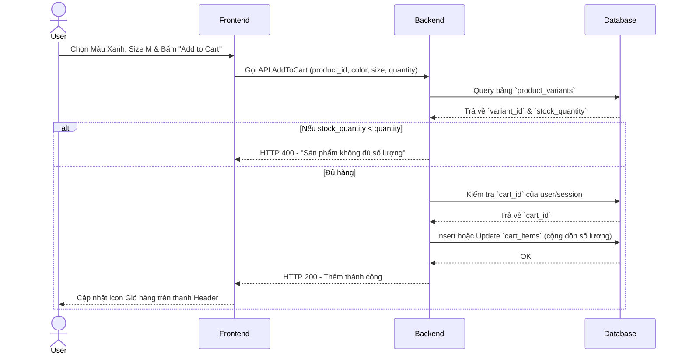
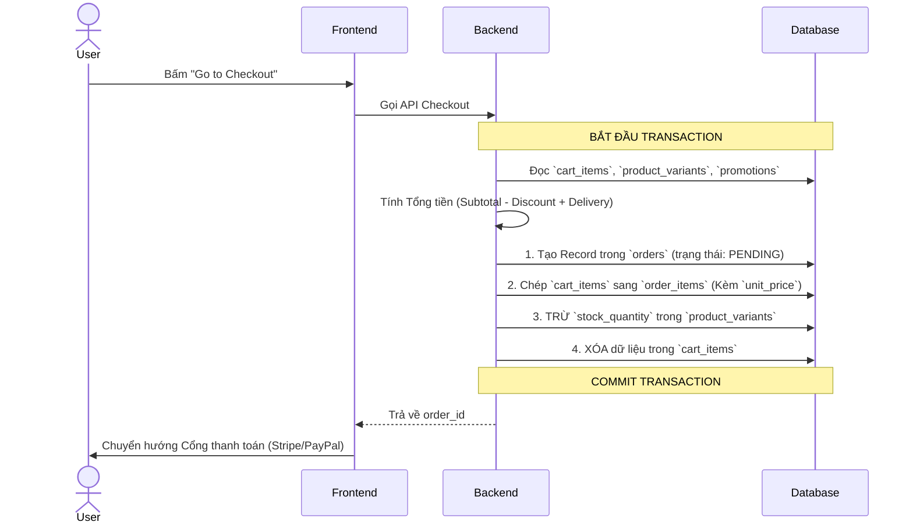

# Tài liệu Thiết Kế Hệ Thống (System Design)
**Dự án:** SHOP.CO E-commerce
**Cập nhật lần cuối:** 2026

Tài liệu này đặc tả kiến trúc Cơ sở dữ liệu (Database Schema) và các luồng nghiệp vụ (Workflows) cốt lõi của hệ thống bán hàng SHOP.CO.

---

## 1. Thiết Kế Cơ Sở Dữ Liệu (Database Schema)

Hệ thống sử dụng mô hình RDBMS, áp dụng kiến trúc tách biệt `Product` (Sản phẩm gốc) và `Product Variants` (Biến thể SKU) để phục vụ cho các bộ lọc phức tạp và quản lý giỏ hàng.

> **Công cụ:** Copy đoạn code DBML dưới đây và dán vào [dbdiagram.io](https://dbdiagram.io) để xem sơ đồ ERD trực quan.

```dbml
// ==========================================
// NHÓM 1: NGƯỜI DÙNG & PHÂN QUYỀN
// ==========================================
Table roles {
  id integer [primary key]
  name varchar [unique, note: 'VD: admin, customer, manager']
  description text
  created_at timestamp
  updated_at timestamp
}

Table users {
  id integer [primary key]
  role_id integer
  email varchar [unique]
  password_hash varchar
  first_name varchar
  last_name varchar
  phone_number varchar [null]
  avatar_url varchar [null]
  is_active boolean [default: true]
  last_login_at timestamp [null]
  created_at timestamp
  updated_at timestamp
}

Table permissions {
  id integer [primary key]
  action_code varchar [unique, note: 'VD: create_product, delete_order']
  module varchar [note: 'VD: Product, Order, System']
}

Table role_permissions {
  role_id integer
  permission_id integer
  indexes { (role_id, permission_id) [pk] }
}

Table user_addresses {
  id integer [primary key]
  user_id integer
  recipient_name varchar
  phone_number varchar
  address_line_1 varchar
  city varchar
  district varchar
  ward varchar
  is_default boolean [default: false]
  created_at timestamp
  updated_at timestamp
}

// ==========================================
// NHÓM 2: SẢN PHẨM & BIẾN THỂ (CATALOG)
// ==========================================
Table brands {
  id integer [primary key]
  name varchar [unique]
  logo_url varchar [null]
}

Table categories {
  id integer [primary key]
  parent_id integer [null]
  name varchar
  slug varchar [unique]
  type varchar [note: 'VD: product_type (Áo thun) hoặc dress_style (Casual)']
}

Table products {
  id integer [primary key]
  brand_id integer [null]
  name varchar
  slug varchar [unique]
  description text
  base_price decimal
  discount_percent integer [default: 0]
  average_rating decimal [default: 0]
  total_reviews integer [default: 0]
  created_at timestamp
}

Table product_categories {
  product_id integer
  category_id integer
  indexes { (product_id, category_id) [pk] }
}

Table product_variants {
  id integer [primary key]
  product_id integer
  sku varchar [unique, note: 'Mã quản lý kho (Barcode)']
  color_name varchar
  color_hex varchar [note: 'VD: #000000 (Để vẽ vòng tròn màu)']
  size varchar
  price_override decimal [null]
  stock_quantity integer [default: 0]
}

Table product_images {
  id integer [primary key]
  product_id integer
  image_url varchar
  is_primary boolean [default: false]
}

// ==========================================
// NHÓM 3: TƯƠNG TÁC (REVIEWS & MARKETING)
// ==========================================
Table reviews {
  id integer [primary key]
  product_id integer
  user_id integer
  rating integer [note: 'Từ 1 đến 5 sao']
  comment text
  is_verified_purchase boolean [default: false, note: 'Tích xanh Verified (Đã mua)']
  created_at timestamp
}

Table newsletter_subscribers {
  id integer [primary key]
  email varchar [unique]
  subscribed_at timestamp
}

// ==========================================
// NHÓM 4: GIỎ HÀNG, KHUYẾN MÃI & ĐƠN HÀNG
// ==========================================
Table carts {
  id integer [primary key]
  user_id integer [null, note: 'Khách vãng lai chưa có user_id']
  session_id varchar [null, note: 'Lưu giỏ hàng theo trình duyệt khách vãng lai']
  created_at timestamp
}

Table cart_items {
  id integer [primary key]
  cart_id integer
  product_variant_id integer [note: 'Lưu đúng ID của size/màu']
  quantity integer
  created_at timestamp
}

Table promotions {
  id integer [primary key]
  code varchar [unique]
  discount_type varchar [note: 'PERCENTAGE hoặc FIXED']
  discount_value decimal
  min_order_value decimal [null]
  valid_from timestamp
  valid_until timestamp
  usage_limit integer [null]
}

Table orders {
  id integer [primary key]
  user_id integer [null]
  status varchar [note: 'PENDING, PAID, SHIPPING, COMPLETED, CANCELLED']
  promotion_id integer [null]
  subtotal decimal
  discount_amount decimal
  delivery_fee decimal
  total_amount decimal
  shipping_address_id integer [null]
  payment_method varchar
  created_at timestamp
  updated_at timestamp
}

Table order_items {
  id integer [primary key]
  order_id integer
  product_variant_id integer
  quantity integer
  unit_price decimal [note: 'BẢN CHỤP GIÁ LÚC MUA']
}

// ==========================================
// KHAI BÁO CÁC MỐI QUAN HỆ (RELATIONSHIPS)
// ==========================================
Ref: users.role_id > roles.id
Ref: role_permissions.role_id > roles.id
Ref: role_permissions.permission_id > permissions.id
Ref: user_addresses.user_id > users.id

Ref: categories.parent_id > categories.id
Ref: products.brand_id > brands.id
Ref: product_categories.product_id > products.id
Ref: product_categories.category_id > categories.id
Ref: product_variants.product_id > products.id
Ref: product_images.product_id > products.id

Ref: reviews.product_id > products.id
Ref: reviews.user_id > users.id

Ref: carts.user_id > users.id 
Ref: cart_items.cart_id > carts.id
Ref: cart_items.product_variant_id > product_variants.id 
Ref: orders.user_id > users.id
Ref: orders.promotion_id > promotions.id
Ref: orders.shipping_address_id > user_addresses.id
Ref: order_items.order_id > orders.id
Ref: order_items.product_variant_id > product_variants.id
```

---

## 2. Luồng Nghiệp Vụ Cốt Lõi (Core Workflows)

### 2.1. Thêm vào Giỏ Hàng (Add to Cart)
Luồng xử lý khi người dùng chọn một Biến thể (Màu sắc, Size) cụ thể và thêm vào giỏ.



### 2.2. Thanh Toán & Chốt Đơn (Checkout)
Quy trình áp dụng Database Transaction để chuyển đổi Giỏ hàng thành Hóa đơn.


